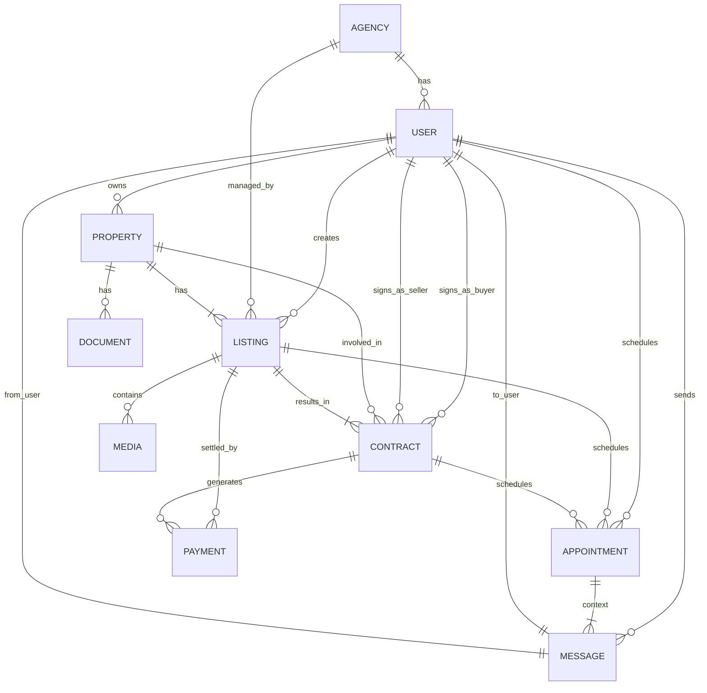

# บทสรุปผู้บริหาร

การออกแบบระบบฐานข้อมูลสำหรับแพลตฟอร์มประกาศอสังหาริมทรัพย์ (ขาย/เช่า) นั้นต้องครอบคลุม **ทรัพย์สิน** (เช่น บ้าน คอนโด ที่ดิน) และ **ประกาศขาย/เช่า** โดยจะมีโมเดลหลักคือ *Property* (ทรัพย์สิน), *Listing* (ประกาศ), *User* (ผู้ใช้), *Contract* (สัญญา), และ *Payment* (การชำระเงิน) รวมถึงโมเดลรอง เช่น *Agency* (บริษัทนายหน้า), *Appointment* (นัดเข้าชม), *Media* (สื่อ), *Document* (เอกสาร) ฯลฯ. โมเดลเหล่านี้จะมีความสัมพันธ์ทางเชิงตรรกะ เช่น ผู้ใช้สามารถเป็นเจ้าของทรัพย์สิน ผู้ใช้ (นายหน้า) สามารถสร้างประกาศได้หนึ่งหรือหลายรายการ การซื้อขาย/เช่าเกิดขึ้นผ่านสัญญาซึ่งเชื่อมโยงระหว่างผู้ซื้อและผู้ขาย และมีการชำระเงินตามสัญญา 【36†L304-L313】【26†L415-L423】. 

ระบบต้องรองรับความหลากหลายของอสังหาริมทรัพย์ (บ้านเดี่ยว, คอนโดมิเนียม, ที่ดิน ฯลฯ) โดยเก็บข้อมูลเฉพาะด้าน (ขนาด เนื้อที่ ชั้น จำนวนห้องนอน ฯลฯ) และสถานะของทรัพย์สิน (เช่น ว่างให้เช่า, ขายแล้ว) ไว้ใน *Property/Listing*【36†L304-L313】【36†L323-L326】. นอกจากนี้ ต้องจัดการ **ผู้ใช้งาน** หลายบทบาท เช่น ผู้ซื้อ ผู้ขาย (เจ้าของ) นายหน้า และผู้ดูแลระบบ โดยแยกสิทธิ์การเข้าถึงตามบทบาท (เช่น นายหน้าสร้างประกาศได้ เจ้าของเห็นประกาศของตน)【11†L267-L274】【32†L99-L106】. ระบบยังต้องสนับสนุนโมเดลแบบ multi-tenant (บริษัทนายหน้าหลายแห่ง) ด้วยการสร้างตาราง *Agency* และเชื่อมโยงผู้ใช้นายหน้าหลายรายกับแต่ละ *Agency*【11†L267-L274】【32†L99-L106】.

สำหรับ **วงจรชีวิตของประกาศ** (listing lifecycle) จะมีสถานะ เช่น ร่าง (Draft), รออนุมัติ (Pending), เปิดใช้งาน (Active), ขาย/ให้เช่าแล้ว (Sold/Rented), หมดอายุ (Expired) เป็นต้น โดยอาจใช้ตารางอ้างอิงสถานะเพื่อบอกว่า listing ใดพร้อมหรือไม่พร้อมให้ค้นหา【36†L316-L326】. ราคากำหนดในประกาศหลัก (หรือสัญญา) รวมถึงข้อมูลความพร้อมใช้งาน (โดยเฉพาะสำหรับเช่าอาจมีปฏิทินจอง) จะบันทึกไว้ใน *Listing* หรือโมเดลย่อย เช่น *Availability* ที่บ่งบอกช่วงเวลาให้เช่า. 

**การจัดการสื่อและเอกสาร** เช่น รูปภาพ วิดีโอของทรัพย์สิน, เอกสารทางกฎหมาย (สำเนาโฉนด, สัญญาเดิม ฯลฯ) ควรเก็บในตารางหรือ bucket แยกตาม *Listing/Property* เพื่อให้ดึงมาแสดงได้. การระบุตำแหน่งสถานที่ (จังหวัด อำเภอ ตำบล และพิกัดละติจูด-ลองจิจูด) จำเป็นต้องมีโมเดลรองรับการค้นหาทางภูมิศาสตร์ (เช่น เก็บพิกัด GPS) เพื่อช่วยในการค้นหาตามทำเลที่ตั้ง.

ระบบต้องบันทึก **ข้อมูลทางกฎหมายและการเป็นเจ้าของ** (เช่น เจ้าของปัจจุบัน ใบอนุญาตก่อสร้าง) ไว้ในโมเดล *Property* หรือ *OwnershipRecord* หากต้องการติดตามประวัติการโอนกรรมสิทธิ์. เมื่อมีการตกลงซื้อขาย/เช่า จะมีการบันทึก *Contract* ร่วมกับ *User* (ผู้ซื้อ-ผู้ขาย) และ *Listing* ดังกล่าว และสร้างรายการ *Invoice/Payment* สำหรับติดตามการชำระเงินตามข้อตกลง【26†L415-L423】【26†L450-L458】.

สำหรับ **การนัดชมและนัดหมาย** (appointment/viewing) สามารถสร้างตาราง *Appointment* หรือ *Schedule* เก็บข้อมูลวัน เวลา สถานะการยืนยัน ระหว่างผู้สนใจ (User) และ *Listing*. ระบบ **ส่งข้อความ/แจ้งเตือน** อัตโนมัติสามารถมีโมเดล *Message* หรือ integration กับระบบ notifications เพื่อติดต่อระหว่างผู้ใช้ (เช่น สอบถามรายละเอียดทรัพย์สิน, นัดหมาย).

ด้าน **การค้นหาและจัดทำดัชนี** จำเป็นต้องวางดัชนี (index) บนฟิลด์ที่มักใช้ค้นหา เช่น ราคา, พื้นที่, ทำเล และอาจใช้บริการค้นหาเต็มข้อความ (full-text search) เพื่อค้นรายละเอียดประกาศได้รวดเร็ว【25†L248-L254】. ส่วน **การตรวจสอบและบันทึก (Audit/Logging)** ควรมีทั้งการเก็บ log ในระดับฐานข้อมูล (trigger บันทึกรายการแก้ไขข้อมูลสำคัญ) และเครื่องมือมอนิเตอร์ระบบ เช่น Microsoft Application Insights【17†L73-L77】 เพื่อเฝ้าสถานะบริการและแจ้งเตือนปัญหา.

สุดท้าย ระบบต้องออกแบบให้รองรับ **ความปลอดภัยและความเป็นส่วนตัว**: กำหนดสิทธิ์การเข้าถึงข้อมูลตามบทบาท, เข้ารหัสข้อมูลสำคัญ เช่น รหัสผ่านผู้ใช้, ปฏิบัติตาม พ.ร.บ.คุ้มครองข้อมูลส่วนบุคคล (PDPA) ในการจัดเก็บข้อมูลส่วนบุคคลของผู้ใช้ (ขอความยินยอม, จัดเก็บข้อมูลเท่าที่จำเป็น) และระบบล็อกดูแลการใช้งานอย่างเข้มงวด.

## แบบจำลองข้อมูลหลัก (ER Diagram)



ภาพ ER ด้านบนแสดงความสัมพันธ์หลักระหว่างโมเดลต่างๆ เช่น ผู้ใช้ (USER) สร้างประกาศ (LISTING), มีทรัพย์สิน (PROPERTY), เซ็นสัญญา (CONTRACT) และ นัดชม (APPOINTMENT) รวมถึงระบบนายหน้า (AGENCY) ที่มีผู้ใช้นายหน้าหลายราย และ **สื่อ** (MEDIA) หรือเอกสารแนบท้าย (DOCUMENT) ที่เกี่ยวข้องกับประกาศหรือทรัพย์สินนั้นๆ.

## รายละเอียดโมเดลและคุณลักษณะสำคัญ

### โมเดล Property (ทรัพย์สิน)

เก็บข้อมูลคุณลักษณะของอสังหาริมทรัพย์ เช่น บ้าน คอนโด ที่ดิน สำหรับขายหรือให้เช่า【36†L304-L313】. ฟิลด์สำคัญได้แก่ 

- **id** (Primary Key)
- **name** (ชื่อทรัพย์สิน)
- **type** (ประเภท เช่น บ้าน/คอนโด/ที่ดิน)
- **description** (รายละเอียด)
- **size** (เนื้อที่, หน่วย ตร.ม.)
- **bedrooms, bathrooms, parking_spaces, balconies** (จำนวนห้องต่างๆ)【36†L308-L312】 
- **pets_allowed** (ยินยอมเลี้ยงสัตว์: boolean สำหรับเช่า)【36†L312-L313】 
- **status** (สถานะปัจจุบัน เช่น available/sold/rented via dictionary)【36†L315-L322】 
- **location** (ที่อยู่: จังหวัด อำเภอ ตำบล, พิกัดละติจูด/ลองจิจูด)

นอกจากนี้ อาจมีตารางลำดับชั้นภูมิศาสตร์ (เช่น ตารางจังหวัด/อำเภอ) หากต้องการมาตรฐานการค้นหาทำเล. เมื่อต้องการ *เจ้าของทรัพย์สิน* กำหนดฟิลด์ owner_user_id (FK ไปยัง USER) เพื่อระบุเจ้าของปัจจุบัน.

### โมเดล Listing (ประกาศขาย/เช่า)

เก็บข้อมูลสำหรับการประกาศบนแพลตฟอร์ม (อาจแยกจาก *Property* เพื่อรองรับกรณีทรัพย์สินหนึ่งอาจมีหลายรายการในครั้งต่างๆ). ฟิลด์สำคัญได้แก่ 

- **id** (PK)
- **property_id** (FK ไปยัง PROPERTY)
- **agent_user_id** (FK ไปยัง USER ที่เป็นนายหน้าสร้างประกาศ) 
- **owner_user_id** (FK ไปยัง USER เจ้าของทรัพย์สิน)
- **title** (หัวข้อประกาศ)
- **description** (รายละเอียดประกาศ) 
- **price** (ราคาขายหรือค่าเช่า) 
- **currency** (สกุลเงิน)
- **availability** (ตัวบ่งชี้ว่าสามารถขาย/เช่าได้เมื่อไหร่ เช่น ช่วงเวลาว่าง)
- **listing_status** (สถานะประกาศ เช่น draft/pending/active/sold/rented/expired)【36†L315-L322】 
- **created_at, updated_at** (เวลาสร้าง-แก้ไข)
- **images, documents** (ความสัมพันธ์กับโมเดล MEDIA/DOCUMENT)

โมเดล *Listing* เชื่อมต่อกับ *Contract* เมื่อมีการขายหรือเช่าสำเร็จ และมีการชำระเงินผ่านโมเดล *Payment* ตามสัญญา. แต่หากเป็นการจองเข้าชมจะเชื่อมกับ *Appointment*.

### โมเดล User (ผู้ใช้)

แทนผู้ใช้งานระบบ ซึ่งอาจเป็น **เจ้าของบ้าน** (Seller), **ผู้ซื้อ/ผู้เช่า** (Buyer/Tenant), **นายหน้า/ตัวแทน** (Agent), หรือ **ผู้ดูแลระบบ** (Admin)【11†L267-L274】【32†L99-L106】. ฟิลด์สำคัญ:

- **id, username, password_hash**
- **name, email, phone**
- **role** (บทบาท เช่น ADMIN, AGENT, AGENCY, OWNER, BUYER)【11†L267-L274】【32†L99-L106】 
- **agency_id** (FK ไปยังตาราง AGENCY หากผู้ใช้เป็นตัวแทน/นายหน้า) 
- **verified, status** (การยืนยันตัวตน/สถานะบัญชี)
- **created_at, updated_at**

แต่ละบทบาทจะมีสิทธิ์การทำงานแตกต่างกัน เช่น นายหน้าสามารถลงประกาศได้ เจ้าของสามารถดู/แก้ไขประกาศของตน ผู้ดูแลระบบจัดการข้อมูลทั้งหมด【11†L267-L274】. ระบบควรกำหนดสิทธิ์การเข้าถึงตามบทบาทอย่างชัดเจน (ACL/Role-based Access Control). 

### โมเดล Agency (นายหน้า/บริษัท)

สำหรับรองรับผู้ใช้หลายๆ รายที่สังกัดบริษัทนายหน้าเดียวกัน (multi-tenant). ฟิลด์สำคัญเช่น:

- **id, name** (ชื่อบริษัท)
- **address, contact_info** (ที่อยู่และติดต่อ)
- **created_at, updated_at**

ตารางนี้ช่วยแยกข้อมูลเพื่อให้ผู้ดูแลระบบสามารถจัดการการเข้าถึงข้อมูลของแต่ละ *Agency* ได้ และอาจใช้ชั้นสิทธิ์ในการประมวลผลดัชนีหรือรายงาน แยกตามบริษัท.

### โมเดล Contract (สัญญา)

เก็บข้อมูลการทำสัญญาระหว่างผู้ซื้อ/ผู้ขายหรือผู้ให้เช่า/ผู้เช่า【26†L415-L423】. ฟิลด์สำคัญ:

- **id** (PK)
- **listing_id** (FK ไปยัง LISTING ที่เกี่ยวข้อง, ถ้ามี)
- **buyer_user_id, seller_user_id** (ผู้ซื้อและผู้ขาย)【26†L415-L423】 
- **agent_user_id** (นายหน้าที่จัดการ, หากมี)
- **type** (ประเภทสัญญา เช่น sale/purchase, rent/lease)
- **details** (เนื้อหาสัญญา)
- **start_date, end_date** (ช่วงเวลาสัญญา)
- **price, fee_percentage, fee_amount** (ราคา สัดส่วนค่าธรรมเนียม และจำนวนค่าธรรมเนียม)【26†L415-L423】 
- **status** (สถานะ เช่น pending/active/completed)
- **created_at, signed_at**

สัญญาอาจเชื่อมโยงกับตาราง *Invoice/Payment* เพื่อบันทึกการชำระค่าตามสัญญา.

### โมเดล Payment (การชำระเงิน)

เก็บรายการชำระเงินทั้งหมดที่เกี่ยวข้องกับสัญญาหรือการจอง【9†L142-L152】【26†L450-L458】. ฟิลด์สำคัญ:

- **id** (PK)
- **contract_id** (FK ไปยัง CONTRACT)
- **amount** (จำนวนเงิน)
- **method** (วิธีการชำระ เช่น โอน, บัตร)
- **date** (วันที่ชำระ)
- **status** (สถานะการชำระ เช่น pending/paid/failed)
- **transaction_ref** (รหัสอ้างอิงจากระบบชำระเงินภายนอก)
- **created_at**

การออกใบแจ้งหนี้ (Invoice) อาจมีตารางแยกต่างหาก หรือรวมในโมเดลนี้ร่วมกับฟิลด์อื่นๆ เช่น invoice_number, due_date, paid_date【26†L450-L459】.

### โมเดล Appointment (การนัดชม)

จัดการการนัดหมายเข้าชมทรัพย์สิน. ฟิลด์สำคัญ:

- **id** (PK)
- **listing_id** (FK ไปยัง LISTING)
- **user_id** (FK ผู้จอง)
- **agent_user_id** (FK นายหน้าดำเนินการ)
- **scheduled_time** (วันที่/เวลานัดชม)
- **status** (เช่น pending/confirmed/canceled)
- **created_at, updated_at**

อาจเพิ่ม *location* (ที่อยู่วันนัด) และบันทึกผลการเข้าชมในฟิลด์ notes.

### โมเดล Message/Notification

รองรับการส่งข้อความระหว่างผู้ใช้หรือระบบ แจ้งเตือนเหตุการณ์ (เช่น นัดหมาย, สถานะประกาศ). เช่น:

- **id, from_user_id, to_user_id, content, sent_time, read_flag**

ข้อมูลเหล่านี้ช่วยติดตามประวัติการสื่อสารภายในระบบ ระหว่างผู้ซื้อ-ผู้ขาย-นายหน้า.

### โมเดล Media และ Document

เก็บข้อมูลไฟล์สื่อที่แนบกับประกาศหรือทรัพย์สิน:

- **MEDIA**: ฟิลด์เช่น id, listing_id (หรือ property_id), url/path, type (image/video), caption, order_index.
- **DOCUMENT**: id, property_id (หรือ listing_id), doc_type (เช่น โฉนด, สัญญา), url, issued_date.

ควรจัดเก็บไฟล์จริงในระบบเก็บไฟล์ (file storage/CDN) แล้วเก็บเพียง path/URL ในฐานข้อมูล.

## ตารางเปรียบเทียบโครงสร้างโมเดล

ตารางด้านล่างสรุปฟิลด์หลักของโมเดลสำคัญ พร้อมชนิดข้อมูลและสถานะความจำเป็น:

| โมเดล (Model) | ฟิลด์ | ชนิดข้อมูล | ต้องมี (Yes/No) | คำอธิบาย |
|---|---|---|---|---|
| **User** | id | UUID/INT | Yes | ไอดีผู้ใช้ (PK) |
|  | username | String | Yes | ชื่อบัญชี |
|  | password_hash | String | Yes | รหัสผ่าน (hash) |
|  | name | String | Yes | ชื่อ-สกุล |
|  | email | String | Yes | อีเมล (ติดต่อ) |
|  | phone | String | No | เบอร์โทร |
|  | role | Enum | Yes | บทบาท (ADMIN, AGENT, OWNER, BUYER)【11†L267-L274】 |
|  | agency_id | FK | No | บริษัทนายหน้าที่สังกัด |
|  | status | String | Yes | สถานะบัญชี (active/inactive) |
|  | created_at | Timestamp | Yes | เวลาสร้างบัญชี |
|  | updated_at | Timestamp | No | เวลาปรับปรุงข้อมูล |
| **Agency** | id | UUID/INT | Yes | ไอดีบริษัท (PK) |
|  | name | String | Yes | ชื่อบริษัท |
|  | address | String | No | ที่อยู่ |
|  | contact_info | String | No | ข้อมูลติดต่อ |
|  | created_at | Timestamp | Yes | เวลาสร้าง |
|  | updated_at | Timestamp | No | เวลาปรับปรุง |
| **Property** | id | UUID/INT | Yes | ไอดีทรัพย์ (PK) |
|  | name | String | Yes | ชื่อทรัพย์ (เช่น ชื่อโครงการ)【36†L304-L312】 |
|  | type | Enum | Yes | ประเภท (Condo, House, Land) |
|  | owner_user_id | FK | Yes | เจ้าของปัจจุบัน (FK ไป User) |
|  | description | Text | No | รายละเอียดทรัพย์ |
|  | area | Float | Yes | พื้นที่ (ตร.ม.)【36†L308-L312】 |
|  | bedrooms | Integer | No | จำนวนห้องนอน【36†L308-L312】 |
|  | bathrooms | Integer | No | จำนวนห้องน้ำ【36†L308-L312】 |
|  | parking_spaces | Integer | No | ที่จอดรถ【36†L308-L312】 |
|  | balconies | Integer | No | ระเบียง【36†L308-L312】 |
|  | pets_allowed | Boolean | No | เลี้ยงสัตว์ได้หรือไม่【36†L312-L313】 |
|  | status | Enum | Yes | สถานะทรัพย์ (available/sold/rented)【36†L315-L322】 |
|  | province, district, subdistrict | String | Yes | ข้อมูลที่อยู่ (จังหวัด/อำเภอ/ตำบล) |
|  | latitude, longitude | Decimal | No | พิกัดภูมิศาสตร์ |
|  | created_at | Timestamp | Yes | เวลาสร้างรายการ |
|  | updated_at | Timestamp | No | เวลาปรับปรุง |
| **Listing** | id | UUID/INT | Yes | ไอดีประกาศ (PK) |
|  | property_id | FK | Yes | FK ไป Property |
|  | agent_user_id | FK | No | นายหน้าสร้างประกาศ (User) |
|  | owner_user_id | FK | Yes | เจ้าของทรัพย์ (User) |
|  | title | String | Yes | ชื่อเรื่องประกาศ |
|  | description | Text | No | เนื้อหาเพิ่มเติม |
|  | price | Decimal | Yes | ราคาขายหรือค่าเช่า |
|  | currency | String | Yes | สกุลเงิน (บาท ฯลฯ) |
|  | listing_status | Enum | Yes | สถานะประกาศ (draft, active, sold, rented)【36†L315-L322】 |
|  | created_at | Timestamp | Yes | เวลาสร้างประกาศ |
|  | updated_at | Timestamp | No | เวลาปรับปรุงประกาศ |
| **Contract** | id | UUID/INT | Yes | ไอดีสัญญา (PK) |
|  | listing_id | FK | Yes | FK ไป Listing |
|  | buyer_user_id | FK | Yes | ผู้ซื้อ/ผู้เช่า (User)【26†L415-L423】 |
|  | seller_user_id | FK | Yes | ผู้ขาย/ผู้ให้เช่า (User)【26†L415-L423】 |
|  | agent_user_id | FK | No | นายหน้าดำเนินการ (User) |
|  | type | Enum | Yes | ประเภทสัญญา (Sale, Rent, Lease) |
|  | details | Text | No | รายละเอียดสัญญา |
|  | start_date | Date | Yes | วันเริ่มสัญญา |
|  | end_date | Date | No | วันสิ้นสุดสัญญา |
|  | total_price | Decimal | Yes | ราคาสัญญา (รวมค่าธรรมเนียม) |
|  | fee_percentage | Decimal | No | ค่าบริการ (%)【26†L415-L423】 |
|  | fee_amount | Decimal | No | จำนวนค่าบริการ (คิดจาก fee_percentage) |
|  | created_at | Timestamp | Yes | เวลาสร้างสัญญา |
| **Payment** | id | UUID/INT | Yes | ไอดีการชำระ (PK) |
|  | contract_id | FK | Yes | FK ไป Contract |
|  | amount | Decimal | Yes | จำนวนเงินที่ชำระ【9†L142-L152】 |
|  | method | String | No | วิธีชำระ (โอน, บัตร) |
|  | paid_at | DateTime | No | วันที่ชำระ |
|  | status | Enum | Yes | สถานะ (pending/paid/failed) |
|  | reference_no | String | No | อ้างอิงธุรกรรมภายนอก |
|  | created_at | Timestamp | Yes | เวลาบันทึกการชำระ |

(หมายเหตุ: ตารางข้างต้นเป็นเพียงตัวอย่างโครงสร้างหลัก สามารถเพิ่มฟิลด์หรือโมเดลย่อยเพิ่มเติมได้ตามความต้องการเฉพาะของระบบ)

## ตัวอย่าง JSON Schemas ของโมเดลหลัก

เพื่อความชัดเจน นี่คือตัวอย่างโครงสร้าง JSON Schema สำหรับโมเดล *Listing, Property, User, Contract, Payment*:

```json
// Listing.json
{
  "id": "uuid",
  "property_id": "uuid",
  "agent_user_id": "uuid",
  "owner_user_id": "uuid",
  "title": "string",
  "description": "string",
  "price": "decimal",
  "currency": "string",
  "listing_status": "string", 
  "created_at": "datetime",
  "updated_at": "datetime"
}
```

```json
// Property.json
{
  "id": "uuid",
  "name": "string",
  "type": "string",
  "owner_user_id": "uuid",
  "description": "string",
  "area": "number",
  "bedrooms": "integer",
  "bathrooms": "integer",
  "parking_spaces": "integer",
  "balconies": "integer",
  "pets_allowed": "boolean",
  "status": "string",
  "province": "string",
  "district": "string",
  "subdistrict": "string",
  "latitude": "number",
  "longitude": "number",
  "created_at": "datetime",
  "updated_at": "datetime"
}
```

```json
// User.json
{
  "id": "uuid",
  "username": "string",
  "password_hash": "string",
  "name": "string",
  "email": "string",
  "phone": "string",
  "role": "string", 
  "agency_id": "uuid",
  "status": "string",
  "created_at": "datetime",
  "updated_at": "datetime"
}
```

```json
// Contract.json
{
  "id": "uuid",
  "listing_id": "uuid",
  "buyer_user_id": "uuid",
  "seller_user_id": "uuid",
  "agent_user_id": "uuid",
  "type": "string",
  "details": "string",
  "start_date": "date",
  "end_date": "date",
  "total_price": "number",
  "fee_percentage": "number",
  "fee_amount": "number",
  "created_at": "datetime"
}
```

```json
// Payment.json
{
  "id": "uuid",
  "contract_id": "uuid",
  "amount": "number",
  "method": "string",
  "paid_at": "datetime",
  "status": "string",
  "reference_no": "string",
  "created_at": "datetime"
}
```

ตัวอย่างข้างต้นแสดงรูปแบบพื้นฐานของข้อมูลที่ระบบอาจจัดเก็บจริง ในการทำงานจริงอาจใช้มาตรฐาน JSON Schema เพิ่มเติม เช่น กำหนด *required* หรือ *format* ของแต่ละฟิลด์.

## ประเด็นด้านเสริม

- **ความเป็นโมดูลและขยายตัว:** ระบบควรออกแบบแบบแยก *Schema* ให้เรียบง่าย และพร้อมรองรับการขยายฟีเจอร์ใหม่ เช่น การเพิ่มระบบสถิติ หรือการเชื่อมต่อ API อื่นๆ โดยโครงสร้างข้อมูลยังคงความยืดหยุ่น.
- **ดัชนี (Index):** สร้างดัชนีบนฟิลด์ที่ค้นหาบ่อย เช่น price, location, status, โดยอาจใช้เทคนิค full-text index ในฟิลด์ข้อความทำเลหรือคำอธิบาย เพื่อเพิ่มประสิทธิภาพการค้นหาข้อมูล【25†L248-L254】.
- **สำรองข้อมูลและกู้คืน:** ระบบฐานข้อมูลควรมีนโยบายสำรองข้อมูลอย่างเหมาะสม (เช่น full backup รายวัน, incremental backup) เพื่อป้องกันข้อมูลสูญหาย และอาจใช้ฟีเจอร์จำลองการอ่าน (read replicas) สำหรับระบบที่มีโหลดสูง.
- **ตรวจสอบและเฝ้าระวัง (Monitoring):** ควรมีระบบมอนิเตอร์การทำงานของ API/DB และแจ้งเตือนกรณีมีปัญหา เช่น ใช้ Microsoft Application Insights เพื่อมอนิเตอร์ประสิทธิภาพและจับข้อผิดพลาด【17†L73-L77】.
- **ความปลอดภัย:** ข้อมูลสำคัญ (รหัสผ่าน, ข้อมูลทางการเงิน) ควรเข้ารหัส/แฮช และจำกัดการเข้าถึงเฉพาะผู้มีสิทธิ์เท่านั้น รวมถึงมาตรการตาม PDPA ในการจัดการข้อมูลส่วนบุคคล.

**อ้างอิง:** ข้อมูลในรายงานนี้ใช้จากแหล่งข้อมูลต่างประเทศและเอกสารทางเทคนิค โดยได้รวบรวมและปรับใช้สำหรับบริบทของระบบประกาศอสังหาริมทรัพย์ในไทย【36†L304-L313】【26†L415-L423】【11†L267-L274】【25†L248-L254】【17†L73-L77】.